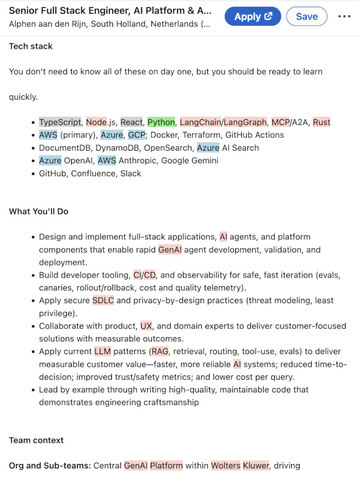
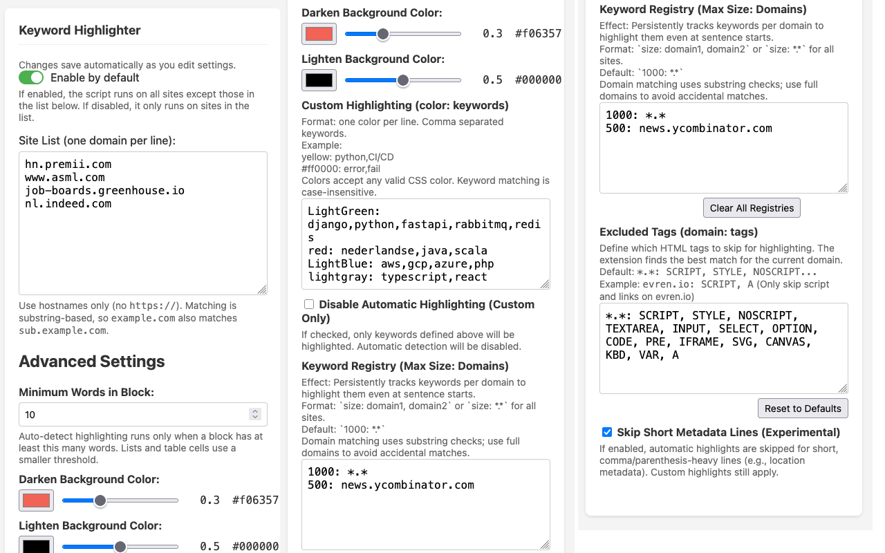

# Smart Keyword Highlighter

**Smart Keyword Highlighter** is a browser extension that improves reading focus by automatically highlighting uppercase and capitalized words on web pages.

## Install

- [**Firefox Add-ons**](https://addons.mozilla.org/en-US/firefox/addon/automatic-keyword-highlighter/)
- [**Chrome Web Store**](https://chromewebstore.google.com/detail/keyword-highlighter/eldhgpjanfaidfdbndllekeaccbonlol?hl=en)

## Screenshots





## Features

- **Smart Highlighting**: Automatically detects and highlights:
  - Uppercase words (e.g., "IMPORTANT")
  - Capitalized words (e.g., "Keyword")
  - Mixed case and hyphenated words
- **CSS Custom Highlight API**: Uses the modern CSS Custom Highlight API for high performance and native-feeling highlights without cluttering the DOM.
- **Adaptive Contrast**: Intelligently adjusts highlight colors based on the background color (light or dark) to ensure readability.
- **Smart Exclusions**:
  - Ignores sentence starters to prevent over-highlighting.
  - Skips specific tags like scripts, styles, inputs, code blocks, and **links (anchor tags)**.
  - Respects `contenteditable` elements.
- **Custom Highlighting**:
  - Define custom keywords with specific colors (e.g., `yellow: Python, Java`).
  - Supports case-insensitive and whole-word matching.
- **Advanced Keyword Registry**:
  - **Persistent Memory**: Remembers highlighted keywords per-domain or globally (`*.*`).
  - **Retroactive Highlighting**: If a keyword is discovered mid-sentence, it gets added to the registry. On subsequent visits (or retroactively on the same page), it will be highlighted even if it appears at the start of a sentence.
  - **Configurable Scope**: Define maximum registry size and scope (global vs. domain-specific).
- **Customizable**:
  - Toggle the extension on or off globally or per-site.
  - Manage site exclusions/inclusions via the options page.
  - **Advanced Settings**:
    - **Minimum Words in Block**: Configure the minimum word count for a block to be highlighted (default: 10).
    - **Custom Colors**: Adjust the background highlight colors and opacity for both light and dark modes.

## Configuration

You can access the configuration page by right-clicking the extension icon and selecting **Options**, or via the extension management page.

### Options

- **Enable by default**: Choose whether the extension runs on all sites (except excluded ones) or only on specific sites.
- **Site List**: A list of domains to exclude (if enabled by default) or include (if disabled by default).
- **Advanced Settings**:
  - **Minimum Words in Block**: Prevents highlighting on short snippets of text (e.g., navigation menus, buttons) by setting a minimum word threshold. _Smartly handles bullet points by allowing shorter blocks when they start with bullet symbols._
  - **Darken/Lighten Background Color**: Sets the highlight color for text on light/dark backgrounds.
  - **Custom Highlights**: Define specific color rules for keywords (e.g., `#ff0000: error, fail`).
  - **Disable Automatic Highlighting**: Option to strictly use only custom highlights, disabling all heuristic-based detection.
  - **Keyword Registry**: Configure the persistent registry (e.g., `1000: *.*` for a global 1000-word registry). Includes a "Clear All" button to reset data.
  - **Excluded Tags**: Configure which HTML tags are skipped during highlighting (e.g., `*.*: SCRIPT, STYLE, A`). Supports per-domain configuration (e.g., `example.com: SCRIPT`).

## Installation

### Chrome (Developer Mode)

1.  Clone or download this repository.
2.  Open Chrome and navigate to `chrome://extensions/`.
3.  Enable **Developer mode** in the top right corner.
4.  Click **Load unpacked**.
5.  Select the `keyword_highlighter` directory (the folder containing `manifest.json`).

### Firefox (Temporary Add-on)

1.  Clone or download this repository.
2.  Open Firefox and navigate to `about:debugging#/runtime/this-firefox`.
3.  Click **Load Temporary Add-on...**.
4.  Select the `manifest.json` file (or any file in the extension directory).
    - _Note: For Firefox development, you may need to use `manifest.firefox.json`. See Development section._

## Development

### Prerequisites

- [Node.js](https://nodejs.org/) and npm

### Setup

1.  Install dependencies:
    ```bash
    npm install
    ```

### Build

To build the project:

```bash
npm run build
```

### Running in Development

**Chrome:**
This command launches a fresh Chrome instance with the extension loaded:

```bash
npm run dev:chrome
```

**Firefox:**
This command prepares the manifest for Firefox and runs it using `web-ext`:

```bash
npm run dev:firefox
```

## License

MIT
